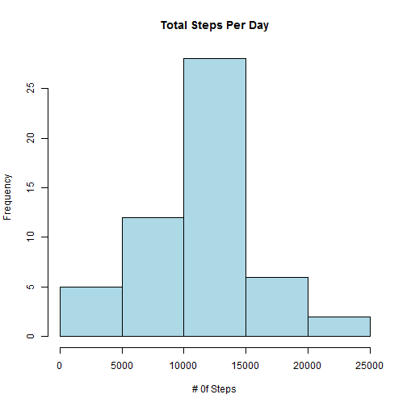
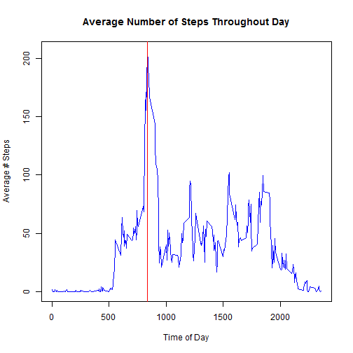
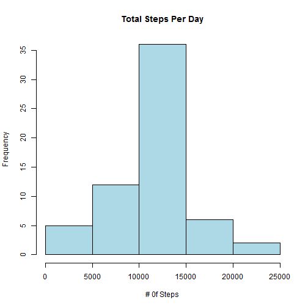
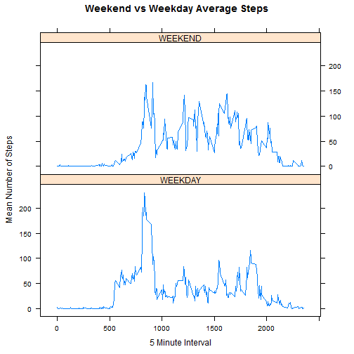

##Reading and Preprocessing the Data


Unzip and open the CSV:

```r
sDat<-read.csv(unzip('C:/Users/a2wilson/Documents/DS_Specialization/Reproducible_Research/PerrAssessment1/activity.zip'))
```

For the first part of the assignment I will use a subset of the data by removing records with N/A for step values:


```r
sDatComp<-sDat[!(is.na(sDat$steps)),]
```

##What is mean total number of steps taken per day?


To find the total number of steps in each day, I use the aggregate function.  This will return a new data frame with a date column and total steps (x) column:

```r
totalStepsPerDay<-aggregate(sDatComp$steps,list(date = sDatComp$date),sum)
```

A histogram can then be created in oder to view the frequency of different daily step total:


```r
hist(totalStepsPerDay$x, main = 'Total Steps Per Day',xlab='# 0f Steps',col= 'light blue')
```

 

Summarizing the total steps column in this datset will reveal the mean and median total steps per day:

```r
summary(totalStepsPerDay$x)
```

```
##    Min. 1st Qu.  Median    Mean 3rd Qu.    Max. 
##      41    8841   10760   10770   13290   21190
```

##What is the average daily activity pattern?


To answer this question we will use a similar aggregation function, accept this time aggregate steps by interval instead of days. This will show average steps throughout the day (0 = Start of Day; 2400 = End of Day).  


```r
asInt<-aggregate(sDatComp$steps,list(interval = sDatComp$interval),mean)

plot(asInt$x~asInt$interval,main='Average Number of Steps Throughout Day',xlab = 'Time of Day', ylab='Average # Steps', type="l",col='blue')

abline(v=asInt[which.max(asInt$x),][1], col='red')
```

 


As seen in the plot, the red line shows the point in time where we observe a maximum average number of steps.  To see both the time of day and number of steps we can run the following command:


```r
asInt[which.max(asInt$x),]
```

```
##     interval        x
## 104      835 206.1698
```

Based on this, we can conclude the 104th 5 minute interval of the day at about 8:35 AM has the highest average amount of steps across all dates with approximately 206 steps.


#Imputing missing values
For the next portion of the exercise we need to go back to the orignal data set and substiture real values for missing values rather than just removing them.

First we calculate how many records are missing values:

```r
nrow(sDat[is.na(sDat$steps),])
```

```
## [1] 2304
```

The strategy for filling in these values will be to take the average total number  of steps for thaat time interval and use that average to replace the missing value.  To get ther I will first break off only records with missing values into a new data frame:


```r
sDatInc<- sDat[is.na(sDat$steps),]
```


For each record in this new data set I need to:
  1. Pull the time interval from the record
  2. Look at the previously created asInt data set to find the mean step total for that interval. 
  3. Replace the missing steps value with the mean step total.
  
I will use a for loop to accomplish these three steps for each record.


```r
for (row in 1:nrow(sDatInc)){
  interv<- (sDatInc[row,3])
  avSteps<-asInt[(asInt$interval==interv),][1,2]
  sDatInc[row,1]<-avSteps
}
```

Just to double check there are no more N/A values:


```r
nrow(sDatInc[is.na(sDatInc$steps),])
```

```
## [1] 0
```

Now, I will simply bind the sDatInc to the previoulsy created sDatComp for a final complete data set with no missing values:


```r
sDatFinal <- rbind(sDatComp,sDatInc)  
```


With this final dataset I will redo the original analysis of total steps taken each day, and see how this impacts the mean and median figures:

will return a new data frame with a date column and total steps (x) column:

```r
tsdFinal<-aggregate(sDatFinal$steps,list(date = sDatFinal$date),sum)
hist(tsdFinal$x, main = 'Total Steps Per Day',xlab='# 0f Steps',col= 'light blue')
```

 

```r
summary(tsdFinal$x)
```

```
##    Min. 1st Qu.  Median    Mean 3rd Qu.    Max. 
##      41    9819   10770   10770   12810   21190
```


Reviewing tdsFinal shows that the imputation had a very minimal impact on the mean and no impact on the median.  So really the only significant difference is the number of observations in the center of our histogram's distribution.

#Are there differences in activity patterns between weekdays and weekends?
To analyze the difference between weekday and weekend average steps per time interval, I will need to create another column of data that gives the day of the week.  Using the weekday() function we can derive this information from the date column:


```r
sDatFinal$day<-weekdays(as.Date(sDatFinal$date))
```

Next I will split this data so that I have a weekday (Mon-Fri)  and weekend (Sat-Sun) data set:


```r
sDatWE<-sDatFinal[((sDatFinal$day=='Saturday')|(sDatFinal$day=='Sunday')),]
sDatWD<-sDatFinal[!((sDatFinal$day=='Saturday')|(sDatFinal$day=='Sunday')),]
```
Again I will aggregate these to find the mean number of step for each interval across all dates:


```r
asIntWE<-aggregate(sDatWE$steps,list(interval = sDatWE$interval),mean)
asIntWD<-aggregate(sDatWD$steps,list(interval = sDatWD$interval),mean)
```

Before joining these data sets back together, I will add a date type column with WEEKEND and WEEKDAY column,.  Since I have them split up already this will be easy:


```r
asIntWE$dayType<-'WEEKEND'
asIntWD$dayType<-'WEEKDAY'
```


Now I will join these datasets back together and make a lattice plot using the newly created dayType variable to split them into separate panels.

```r
asIntFinal<-rbind(asIntWE,asIntWD)
library(lattice)
xyplot(x~interval|factor(dayType),data = asIntFinal,type="l",layout =c(1,2),main = "Weekend vs Weekday Average Steps", xlab="5 Minute Interval",ylab="Mean Number of Steps")
```

 

From these graphs it looks like there is definitely more variance on the weekends with different peaks throughout the day. Also the patterns confirm that this individual typically wakes up later on weekends and is more active throughout the day.
